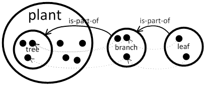
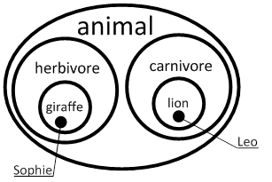
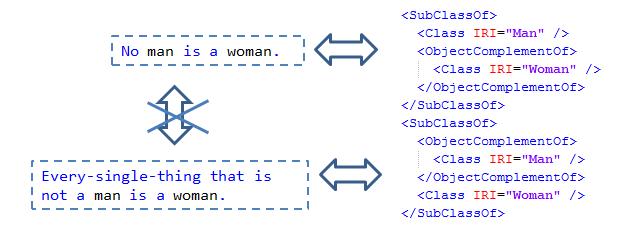
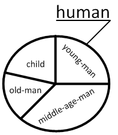
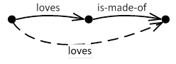

.. role:: blue
.. role:: red

Grammar
========

Semantic Web, Ontologies
------------------------

The Semantic Web encourages the inclusion of semantic content in web pages, databases and systems. The semantic technologies are standardized by the international standards body, the World Wide Web Consortium [W3C, http://www.w3.org/]. According to the W3C, "The Semantic Web provides a common framework that allows data to be shared and reused across application, enterprise, and community boundaries." Thus the Semantic Web plays an important role with respect to the advancement of information management, collaboration and information sharing [S. Staab, R. Studer, Handbook on Ontologies, 2nd ed., Springer 2009]. Ontologies and also all the aspects of semantic technologies (e.g. OWL, SWRL rules, reasoners) allow to represent static knowledge about given part of the world. Ontologies are used for sharing knowledge and common understanding of a particular domain of interest, which makes communication between various beings possible and unambiguous. The various actors may be human users with different levels of expertise or computer programs (agents). OWL stands for Web Ontology Language [http://www.w3.org/TR/owl2-semantics/]. It is developed by the W3C’s Web Ontology Working Group and intended to be the successor of DAML+OIL. OWL is the most expressive knowledge representation for the Semantic Web so far. It allows us to write explicit, formal conceptualizations of human endeavor. OWL can be used in a spectrum of tasks that appears in the semantic web applications. It allows describing the application domain (where formal semantic plays a crucial role) and application specification, database schema, database constraints as well as database content using common language. On the other hand OWL can be used as a language that allows domain experts (a person with special knowledge or skills in a particular area of endeavor) to express domain-specific knowledge (valid knowledge used to refer to an area of human endeavor). The importance of a well-defined, formal language is clear and known from the area of programming languages; it is a necessary condition for machine-processing of information; it describes the meaning of knowledge precisely; it does not refer to subjective intuitions, nor is it open to different interpretations by different people (or machines). On the other hand, it is questionable whether the XML-based syntax for OWL is very user-friendly.

CogniPy Basic Features
----------------------

Controlled Natural Language (CNL)
^^^^^^^^^^^^^^^^^^^^^^^^^^^^^^^^^
CogniPy provides an alternative that is more suitable for human users. We propose to use Controlled English as a knowledge modeling language. Supported via Predictive Editor, it prohibits one from entering any sentence that is grammatically or morphologically incorrect and actively helps the user during sentence writing. The Controlled English is a subset of Standard English with restricted grammar and vocabulary, in order to reduce the ambiguity and complexity inherent in full English. In the last years, Controlled English established itself in various application fields as a powerful knowledge representation language that is readable by humans and processable by computers. Texts in Controlled English can be automatically translated into and from description logic, concretely SROIQ, the basis of the semantic web language OWL 2.

Ontology Editors
^^^^^^^^^^^^^^^^
There are dozens of ontology editors known and their number is increasing every day. The most famous is Protégé which allows editing ontology and inspecting the inferred knowledge [http://protege.stanford.edu/]. Both Protégé and CogniPy allow support of knowledge engineering. The main difference between CogniPy and Protégé, however, lies in the way how the user interacts with the editor. To understand the meaning of formally ascribed knowledge one is required to have a background in the field of a formal method, especially in logic. It is hard to trace a formal knowledge for any authority that does not have such background. On the other hand, without the support of formal methods it is almost impossible to trace and understand the impact of even small changes in the knowledge. This pragmatic observation of need for a “human-readable language” knowledge modeling language led us to the development of CogniPy. When using CogniPy, users do not need any training in formal logic formalisms nor the ICT support. They are continuously checked if the entered knowledge fulfills the grammar. Additionally, knowledge engineers are provided with the ability to explore the knowledge, due to embedded reasoner that constantly checks the consistency of the knowledge base.

CogniPy Grammar Intro
^^^^^^^^^^^^^^^^^^^^^
The grammar of the suported language deals with concepts, instances, roles(=relations), attributes and rules that can be represented by symbols in a form of words. Concept and role identifiers must start with small letter in opposite to instances and also both of them cannot be any of keywords. The morphology is applied if needed by separated dictionary based module. Additionally, it is required that each sentence starts with capital letter and ends with a ‘full stop’. Groups of sentences that are allowed are as following: concept, instance, role, data attributes and simple rule (corresponding to SWRL rule subset) specifications.

Naming Conventions
------------------

Naming in OWL
^^^^^^^^^^^^^
OWL deals with entities that are related to each other. All OWL entities are represented using Internationalized Resource Identifiers (IRIs) [RFC3987]. Here we only assume that IRI has form: namespace#identifier e.g. IRI: ‘http://sample.org/ontologies/human.owl#woman’ is composed from namespace ‘http://sample.org/ontologies/human.owl’ and identifier ‘woman’. We assume that the following OWL naming convention is used for identifiers:

* Each owl class (concept) or named individual (instance) identifier is a noun or a name in singular form that is written using camel case, starting with a capital letter.
    * Example) VeryBeautifulGirl, JohnDow.
* Each owl object and data property (role, attribute) identifier is a verb in past-participle form in camel case starting with a small letter.
    * Example) isPartOf, hasAge.

This naming convention is not a part of the standard, it is a general naming recommendation, and therefore there exist OWL ontologies that do not fulfill above requirements. We say that OWL identifiers that do not fulfill above recommendation are non-standard in opposite to standard ones.

Naming in CogniPy
^^^^^^^^^^^^^^^^^
In CogniPy grammar we use slightly different naming convention, as long as we want to be as close to the natural language as possible. Instead of camel case, we use dash to separate parts of names. However, to make the mapping possible we use the following rules:

* All standard owl class identifiers are transformed into small-letter starting buzz-words. e.g. VeryBeautifulGirl → very-beautiful-girl

.. list-table::
    :widths: 25 25
    :header-rows: 1
    :align: center

    * - Identifier in OWL
      - Identifier in CogniPy
    * - VeryBeautifulGirl
      - very-beautiful-girl

‎

* All standard owl named individuals are transformed into capital-letter starting buzz-words. e.g. JohnDow → John-Dow

.. list-table::
    :widths: 25 25
    :header-rows: 1
    :align: center

    * - Individual in OWL
      - Individual in CogniPy
    * - JohnDow
      - John-Dow

‎

* All standard owl object and data properties are transformed into small-letter starting buzz-words and it is assumed that first part is in present-perfect and therefore it is changed into present simple, e.g. isPartOf → be-part-of, hasAge → have-age

.. list-table::
    :widths: 25 25
    :header-rows: 1
    :align: center

    * - Individual in OWL
      - Individual in CogniPy
    * - isPartOf
      - be-part-of
    * - hasAge
      - have-age

‎

Dealing with Naming Conflicts
^^^^^^^^^^^^^^^^^^^^^^^^^^^^^
If name-conflict occurs, caused by multiple OWL IRIs with common identifier, there is attached prefix in a form of [in-terms-of ], so e.g.: if two IRIs exist - http://sample.org/ontologies/human.owl#VeryBeautifulGirl and http://other.eu/girls.owl#VeryBeautifulGirl then they are represented as very-beautiful-girl [in-terms-of human] and very-beautiful-girl [in-terms-of girls] .

Non-standard Identifiers
^^^^^^^^^^^^^^^^^^^^^^^^

Non-standard identifiers are transformed as they are surrounded with quotation marks:

* All non-standard owl class, object and data property identifiers are transformed directly.

.. list-table::
    :widths: 25 25
    :header-rows: 1
    :align: center

    * - Individual in OWL
      - Individual in CogniPy
    * - HasPartOf
      - “HasPartOf”

‎

* All non-standard owl named individuals are prefixed with ‘THE’.

.. list-table::
    :widths: 25 25
    :header-rows: 1
    :align: center

    * - Individual in OWL
      - Individual in CogniPy
    * - CogniPy
      - THE-“CogniPy”

‎

Concept Specification
---------------------
Concept Subsumption
^^^^^^^^^^^^^^^^^^^

A concept subsumption represents all cases where there is a need to specify the fact about a specific concept or instance (or expressions which can be reduced to a concept or instance) in form of a subsumption.

.. parsed-literal::
    :blue:`Every` cat :blue:`is a` mammal.
    :blue:`Every` cat :blue:`that is a` brown-one has :blue:`a` red-eye.

.. parsed-literal::
    Mary :blue:`is married by` John.
    John knows :blue:`a` programming-language.

The concept subsumption can be seen as a kind of set inclusion. We say that one concept subsumes the other one if the set described by the first concept is a subset of the other one. The most intuitive way to say it in English is when speaking about instances of concepts - members of sets. We say then "Every tree is a plant." and it means that every single tree is also a plant, or - what is equivalent - if something is a tree then it is a plant too, or - all trees are plants.

The following example shows how the mapping between the simplest concept subsumption in CogniPy English and OWL2 is made:

.. parsed-literal::
    :blue:`Every` tree :blue:`is a` plant.

.. code-block:: xml

    <SubClassOf>
        <Class IRI="Tree" />
        <Class IRI="Plant" />
    </SubClassOf>

A concept can be subsumed by a complex expression that includes roles and attributes. The most common one is existential role restriction.

.. parsed-literal::
    :blue:`Every` branch :blue:`is-part-of a` tree.

.. code-block:: xml

    <SubClassOf>
        <Class IRI="Branch" />
        <ObjectSomeValuesFrom>
                <ObjectProperty IRI="isPartOf"/>
            <Class IRI="Tree" />
        </ObjectSomeValuesFrom>
    </SubClassOf>

It is important to understand that this statement do not force that every branch is only the part of tree. To do this we need universal restriction.

.. parsed-literal::
    :blue:`Every` lion eats :blue:`nothing-but` herbivore.

.. code-block:: xml

    <SubClassOf>
        <Class IRI="Lion" />
        <ObjectAllValuesFrom>
                <ObjectProperty IRI="eats"/>
            <Class IRI="Herbivore" />
        </ObjectAllValuesFrom>
    </SubClassOf>

.. note::

    Both (existential and universal) restrictions are complementary to each other. Please remember that one :red:`does not imply` the other. In CogniPy CNL the only difference between them lies in the usage of :blue:`nothing-but` keyword, however this simple keyword makes here a big semantic difference.

Restrictions can be arbitrary complex, if used with :blue:`"that ..."` statement, as in following examples.

Here, the **union** of concepts is used as a range of a restriction.

.. parsed-literal::
    :blue:`Every` giraffe eats :blue:`nothing-but thing that is a` leaf :blue:`and-or is a` twig.

.. code-block:: xml

    <SubClassOf>
        <Class IRI="Giraffe" />
        <ObjectAllValuesFrom>
                <ObjectProperty IRI="eats"/>
           <ObjectUnionOf>
                <Class IRI="Leaf" />
              <Class IRI="Twig" />
           </ObjectUnionOf>
        </ObjectAllValuesFrom>
    </SubClassOf>

However it is also possible to use the **intersection.**

.. parsed-literal::

   :blue:`Every` tasty-plant :blue:`is` eaten :blue:`by a` carnivore :blue:`and is` eaten :blue:`by a` herbivore.

.. code-block:: xml

    <SubClassOf>
        <Class IRI="TastyPlant" />
        <ObjectIntersectionOf>
          <ObjectSomeValuesFrom>
            <ObjectInverseOf>
                    <ObjectProperty IRI="eats"/>
            </ObjectInverseOf>
            <Class IRI="Carnivore" />
          </ObjectSomeValuesFrom>
          <ObjectSomeValuesFrom>
             <ObjectInverseOf>
               <ObjectProperty IRI="eats"/>
             </ObjectInverseOf>
               <Class IRI="Herbivore" />
          </ObjectSomeValuesFrom>
         </ObjectIntersectionOf>
    </SubClassOf>

A **complement** of a concept can also be specified this way.

.. parsed-literal::

   :blue:`Every` palm-tree has-part :blue:`something that is not a` branch.

.. code-block:: xml

    <SubClassOf>
        <Class IRI="PalmTree" />
        <ObjectSomeValuesFrom>
            <ObjectProperty IRI="hasPart"/>
            <ObjectComplementOf>
                <Class IRI="Branch" />
            </ObjectComplementOf>
            </ObjectSomeValuesFrom>
        </SubClassOf>

Concept Equivalence
^^^^^^^^^^^^^^^^^^^

It is important to understand the way how implication states in
concept subsumption. If we say that *"Every tree is a plant"* it
:red:`does not` implicate that *"Every plant is a tree"*. It might be
obvious using this simple example, however it is a common logical
mistake to use concept subsumption where concept equivalence is
appropriate. For example, by saying :blue:`Every` boy :blue:`is a` young-male-man,
you only mean that all boys are young-male-man. However you might
think that you said also that all young-male-man are boys - but you
didn't utter it in a logical way.
If you really want to express such a notion then you need to use
**concept equivalence**: :blue:`Something is a` boy :blue:`if-and-only-if-it is a`
young-male-man".

   It is possible to express arbitrary complex axioms using concept
   equivalence.

.. list-table::
    :widths: 25 25 25
    :header-rows: 1
    :align: center

    * - | Something is a boy if-and-only-if-it is a young-male-man.
        |
      -
      - | Every boy is a young-male-man.
        | Every young-male-man is a boy.
    * - .. code-block:: xml

            <EquivalentClasses>
                <Class IRI="Boy" />
                <Class IRI="YoungMaleMan" />
            </EquivalentClasses>

      -
      - .. code-block:: xml

            <SubClassOf>
                <Class IRI="Boy" />
                <Class IRI="YoungMaleMan" />
            </SubClassOf>
            <SubClassOf>
                <Class IRI="YoungMaleMan" />
                <Class IRI="Boy" />
            </SubClassOf>

More examples:

.. parsed-literal::

   :blue:`Something is a` man :blue:`if-and-only-if-it is an` adult :blue:`that is a` male :blue:`and is a` person.

.. code-block:: xml

    <EquivalentClasses>
        <Class IRI="Man" />
        <ObjectIntersectionOf>
          <Class IRI="Adult" />
          <Class IRI="Male" />
          <Class IRI="Person" />
        </ObjectIntersectionOf>
    </EquivalentClasses>

Example 2)

.. parsed-literal::

   :blue:`Something is a` herbivore :blue:`if-and-only-if-it` eats :blue:`nothing-but` plant :blue:`and-or` eats :blue:`nothing-but thing that` is-part-of :blue:`a` plant.

.. code-block:: xml

    <EquivalentClasses>
        <Class IRI="Herbivore" />
        <ObjectUnionOf>
          <ObjectAllValuesFrom>
              <ObjectProperty IRI="eats" />
              <Class IRI="Plant" />
          </ObjectAllValuesFrom>
          <ObjectAllValuesFrom>
              <ObjectProperty IRI="eats" />
              <ObjectSomeValuesFrom>
                  <ObjectProperty IRI="isPartOf" />
                  <Class IRI="Plant" />
              </ObjectSomeValuesFrom>
          </ObjectAllValuesFrom>
        </ObjectUnionOf>
    </EquivalentClasses>

Disjoint Concepts
^^^^^^^^^^^^^^^^^

| The open-world assumption :red:`does not` imply that some things (e.g.
    concepts, instantions) are disjoint if they are named differently.
    The disjointness must be here specified explicitly.
| Disjoint concepts represents all cases where there is a need to
    specify that concepts are mutually-exclusive.
| E.g.: \* :blue:`No` man :blue:`is a` woman.
|        \* :blue:`Every` herbivore :blue:`is not a` carnivore.
|        \* :blue:`No` herbivore :blue:`is a` carnivore.

To disjoint concepts you can define it in two different ways as
follows. Two sentences in this example are sematically equivalent as
well as in OWL syntax.

.. list-table::
    :widths: 25 25 25
    :header-rows: 1
    :align: center

    * - Every herbivore is not a carnivore.
      -
      - No herbivore is a carnivore.
    * - .. code-block:: xml

            <SubClasseOf>
                <Class IRI="Herbivore" />
                <ObjectComplementOf>
                    <Class IRI="Carnivore" />
                </ObjectComplementOf>
            </SubClasseOf>

      -
      - .. code-block:: xml

            <SubClasseOf>
                <Class IRI="Herbivore" />
                <ObjectComplementOf>
                    <Class IRI="Carnivore" />
                </ObjectComplementOf>
            </SubClasseOf>

.. note::

    It is worth to mention that saying, e.g. "Every-single-thing that is
    not a man is a woman.", we assume that everything in our world is
    either a man or it is a woman, while "No man is a woman" means that
    there can exists things that are neither man nor woman in the
    universe. In other words while in first case we deal with mutually
    complementary concepts, in the second case we deal with disjoint
    ones.

Value Partition
^^^^^^^^^^^^^^^

A disjoint union axiom states that a given class is a disjoint union
of several class expressions. Moreover, all of which are pairwise
disjoint.

.. parsed-literal::

   :blue:`Something is a` human :blue:`if-and-only-if-it-either is a` child, :blue:`is an` old-man, :blue:`is a` middle-aged-man :blue:`or is a` young-man.

.. code-block:: xml

    <DisjointUnion>
        <Class IRI="Human" />
       <Class IRI="Child" />
       <Class IRI="MiddleAgedMan" />
       <Class IRI="OldMan" />
       <Class IRI="YoungMan" />
    </DisjointUnion>

Cardinality Restriction
^^^^^^^^^^^^^^^^^^^^^^^

| Cardinality restrictions on concepts can be applied by using
    keywords like :blue:`at-most` or :blue:`at-least`.
| If none of them is specified then it is assumed that the meaning of
    cardinality is **exactly**.

.. parsed-literal::

   :blue:`Every` person is-a-child-of :blue:`at-most` two parents.

.. code-block:: xml

    <SubClassOf>
        <Class IRI="Person" />
        <ObjectMaxCardinality cardinality="2" >
            <ObjectProperty IRI="isChildOf"/>
        <Class IRI="Parent">
        </ObjectMaxCardinality>
    </SubClassOf>

Example 2)

.. parsed-literal::

   :blue:`Every` person is-a-child-of :blue:`at-least` two parents.

.. code-block:: xml

    <SubClassOf>
        <Class IRI="Person" />
        <ObjectMinCardinality cardinality="2" >
            <ObjectProperty IRI="isChildOf"/>
        <Class IRI="Parent">
        </ObjectMinCardinality>
    </SubClassOf>

example 3)

.. parsed-literal::

   :blue:`Every` person is-a-child-of two parents.

.. code-block:: xml

    <SubClassOf>
        <Class IRI="Person" />
        <ObjectExactCardinality cardinality="2" >
            <ObjectProperty IRI="isChildOf"/>
        <Class IRI="Parent">
        </ObjectExactCardinality>
    </SubClassOf>

Below is a list of keywords and corresponding restrictions:

.. list-table::
    :widths: 25 25
    :header-rows: 1

    * - Keywords
      - Meaning
    * - less-than
      - <
    * - more-than
      - >
    * - at-most
      - ≤
    * - at-least
      - ≥
    * - different-than
      - ≠

Has-key Expression (Experimental)
^^^^^^^^^^^^^^^^^^^^^^^^^^^^^^^^^

| Keys are a useful way of expressing, by means of a description, that
  two or more individuals are necessarily identical.
| By using a keyword is-unique-if, you can express such a meaning : If
  two individuals X and Y have the same key values, then X = Y.

.. parsed-literal::

   :blue:`Every X that is a` man :blue:`is-unique-if X` has-id :blue:`something and X` has-security-number :blue:`something`.

.. code-block:: xml

    <HasKey>
        <Class IRI="Man" />
        <ObjectProperty IRI="hasId"/>
        <ObjectProperty IRI="hasSecurityNumber"/>
    </HasKey>

Defining Complex Concepts
^^^^^^^^^^^^^^^^^^^^^^^^^

| By combining above expressions we can define complex concepts.
| Below line defines a cat is not a bird, if it is an animal and it has
  more than or equal to 5 legs.  Two expressions are used to describe it
  : setting object minimum cardinality by 5, and object intersection.

.. parsed-literal::

   :blue:`If a` cat  :blue:`is an` animal  :blue:`that` has at-least five legs  :blue:`then the` cat  :blue:`is something that is not a` bird.

.. code-block:: xml

    <DLSafeRule>
     <Body>
       <ClassAtom>
           <Class IRI="Cat" />
           <Variable IRI="CatX" />
       </ClassAtom>
       <ClassAtom>
           <ObjectIntersectionOf>
                <Class IRI="Animal" />
                <ObjectMinCardinality cardinality="5">
                    <ObjectProperty IRI="has" />
                    <Class IRI="Leg" />
                </ObjectMinCardinality>
          </ObjectIntersectionOf>
          <Variable IRI="CatX" />
       </ClassAtom>
      </Body>
      <Head>
          <ClassAtom>
             <ObjectComplementOf>
               <Class IRI="Bird" />
             </ObjectComplementOf>
             <Variable IRI="CatX" />
          </ClassAtom>
     </Head>
    </DLSafeRule>

Instance Specifications
-----------------------

To specify the **instance of a concept**, a simple class assertion is
often enough.

.. parsed-literal::

   Sophie :blue:`is a` giraffe.

.. code-block:: xml

    <ClassAssertion>
        <Class IRI="Giraffe" />
        <NamedIndividual IRI="Sophie" />
    </ClassAssertion>

However, it is also possible to make complex specifications about
instances and their relationships.

|

Role Specifications
-------------------

We can apply axioms to roles. The axioms modify semantic sense of the
roles. All of them are in fact a kind of semantic sugar and can be
though as special cases of a general role inclusion and concept
subsumption axioms.

General Role Inclusion
^^^^^^^^^^^^^^^^^^^^^^

Role inclusions are represented by if expressions.

.. parsed-literal::

   :blue:`If X` is-proper-part-of :blue:`Y then X` is-part-of :blue:`Y`.

.. code-block:: xml

    <SubObjectPropertyOf>
        <ObjectProperty IRI="isProperPartOf" />
        <ObjectProperty IRI="isPartOf" />
    </SubObjectPropertyOf>

Axioms on Roles
^^^^^^^^^^^^^^^

| Simple axioms on roles are:
| Transitivity, e.g.:

.. parsed-literal::

   :blue:`If X` has-part :blue:`something that` has-part :blue:`Y then X` has-part :blue:`Y`.

.. code-block:: xml

    <TransitiveObjectProperty>
        <ObjectProperty IRI="hasPart" />
    </TransitiveObjectProperty>

|

- Reflexivity, e.g.:

.. parsed-literal::

   :blue:`Every-single-thing` is-part-of :blue:`itself`.

.. code-block:: xml

    <ReflexiveObjectProperty>
        <ObjectProperty IRI="isPartOf" />
    </ReflexiveObjectProperty>

|

- Irreflexivity, e.g.:

.. parsed-literal::

   :blue:`Every-single-thing is not a thing that` is-proper-part-of :blue:`itself`.

.. code-block:: xml

    <SubClassOf>
        <Class abbreviatedIRI="owl:Thing" />
        <ObjectComplementOf>
           <ObjectHasSelf>
                <ObjectProperty IRI="isProperPartOf" />
           </ObjectHasSelf>
       </ObjectComplementOf>
    </SubClassOf>

|

- Symmetry, e.g.:

.. parsed-literal::

   :blue:`X` is-friend-of :blue:`Y if-and-only-if Y` is-friend-of :blue:`X`.

.. code-block:: xml

    <EquivalentObjectProperties>
       <ObjectProperty IRI="isFriendOf" />
       <ObjectInverseOf>
            <ObjectProperty IRI="isFriendOf" />
       </ObjectInverseOf>
    </EquivalentObjectProperties>

|

It is possible to enter any complex role expression using :blue:`something
that`, e.g.:

Properties and relationships between roles in terms of expressiveness of
OWL2 can be utter as the following rule: If X has something that has Y
then X has Y.

.. parsed-literal::

   :blue:`If X` is-proper-part-of :blue:`Y then X` is-part-of :blue:`Y`.

.. code-block:: xml

    <SubObjectPropertyOf>
        <ObjectProperty IRI="isProperPartOf" />
        <ObjectProperty IRI="isPartOf" />
    </SubObjectPropertyOf>

|

Role Equivalence
^^^^^^^^^^^^^^^^

Equivalent roles are defined with the use of :blue:`if-and-only-if` keyword.

.. parsed-literal::

   :blue:`X` is-close-to Y :blue:`if-and-only-if X` is-near-to :blue:`Y`.

.. code-block:: xml

    <EquivalentObjectProperties>
       <ObjectProperty IRI="isCloseTo" />
        <ObjectProperty IRI="isNearTo" />
    </EquivalentObjectProperties>

The definition of equivalence is useful. For example, a single sentence
of role equivalence is semantically identical with two sentences of role
inversion.

| Example)

.. list-table::
    :widths: 25 25 25
    :header-rows: 1
    :align: center

    * - Role Equivalence
      -
      - Role Inversion
    * - :blue:`X` is-type-of :blue:`Y if-and-only-if Y` has-type-that-is :blue:`X`.
      -
      -	| :blue:`If X` is-type-of :blue:`Y then Y` has-type-that-is :blue:`X`.
        | :blue:`If X` has-type-that-is :blue:`Y then Y` is-type-of :blue:`X`.
    * - .. code-block:: xml

            <EquivalentObjectProperties>
                <ObjectProperty IRI="isTypeOf" />
                <ObjectInverseOf>
                    <ObjectProperty IRI="hasTypeThatIs" />
                </ObjectInverseOf>
            </EquivalentObjectProperties>

      -
      - .. code-block:: xml

            <SubObjectPropertyOf>
                <ObjectProperty IRI="isTypeOf" />
                <ObjectInverseOf>
                    <ObjectProperty IRI="hasTypeThatIs" />
                </ObjectInverseOf>
            </SubObjectPropertyOf>
            <SubObjectPropertyOf>
                <ObjectProperty IRI="hasTypeThatIs" />
                <ObjectInverseOf>
                    <ObjectProperty IRI="isTypeOf" />
                </ObjectInverseOf>
            </SubObjectPropertyOf>

|

Disjoint Roles
^^^^^^^^^^^^^^

Disjoint roles are opposite to equivalent.

.. parsed-literal::

   :blue:`If X` loves :blue:`Y then X does-not` hate :blue:`Y`.

.. code-block:: xml

    <DisjointObjectProperties>
        <ObjectProperty IRI="hates" />
        <ObjectProperty IRI="loves" />
    </DisjointObjectProperties>

Ranges and Domains
^^^^^^^^^^^^^^^^^^

It is possible to describe the role range.

.. parsed-literal::

   :blue:`Every-single-thing` eats :blue:`nothing-but thing that is an` animal :blue:`and-or is a` plant :blue:`and-or` is-part-of :blue:`an` animal :blue:`and-or` is-part-of :blue:`a` plant.

.. code-block:: xml

    <SubClassOf>
       <Class abbreviatedIRI="owl:Thing" />
          <ObjectAllValuesFrom>
                <ObjectProperty IRI="eats" />
           <ObjectUnionOf>
                <Class IRI="Animal" />
               <Class IRI="Plant" />
                  <ObjectSomeValuesFrom>
                   <ObjectProperty IRI="isPartOf" />
                   <Class IRI="Animal" />
               </ObjectSomeValuesFrom>
               <ObjectSomeValuesFrom>
                   <ObjectProperty IRI="isPartOf" />
                   <Class IRI="Plant" />
               </ObjectSomeValuesFrom>
            </ObjectUnionOf>
          </ObjectAllValuesFrom>
    </SubClassOf>

|

Role domain can be expressed with the use of a reverse role.

.. parsed-literal::

   :blue:`Every-single-thing is` eaten :blue:`by an` animal.

.. code-block:: xml

    <SubClassOf>
       <Class abbreviatedIRI="owl:Thing" />
       <ObjectSomeValuesFrom>
           <ObjectInverseOf>
                <ObjectProperty IRI="eats" />
           </ObjectInverseOf>
           <Class IRI="Animal" />
       </ObjectSomeValuesFrom>
    </SubClassOf>

Data Attributes (Properties) Specifications
-------------------------------------------

To specify a **datatype** of data property, you can do it as follows.

.. list-table::
    :widths: 25 25
    :header-rows: 1
    :align: center

    * - Keywords
      - Meaning
    * - :blue:`(some value)`
      - equivalent to rdfs:Literal. This can take any data type but without knowing what type this data is.
    * - :blue:`(some integer value)`
      -  equivalent to xsd:int.
    * - :blue:`(some real value)`
      -  equivalent to xsd:double.
    * - :blue:`(some boolean value)`
      -  equivalent to xsd:boolean.
    * - :blue:`(some string value)`
      -  equivalent to xsd:string.
    * - :blue:`(some datetime value)`
      -  equivalent to xsd:datetime.
    * - :blue:`(some duration value)`
      -  equivalent to xsd:duration. (currently only swrlb:dayTimeDuration is supported)

| Example 1)

.. parsed-literal::

   :blue:`Every` person has-name :blue:`nothing-but (some string value)`.

.. code-block:: xml

    <SubClassOf>
       <Class IRI="Person" />
       <DataAllValuesFrom>
            <DataProperty IRI="hasName" />
           <DataType abbreviatedIRI="xsd:string" />
       </DataAllValuesFrom>
    </SubClassOf>

|
| Example 2)

.. parsed-literal::

   :blue:`Every` person has-age :blue:`nothing-but (some integer value)`.

.. code-block:: xml

    <SubClassOf>
       <Class IRI="Person" />
       <DataAllValuesFrom>
            <DataProperty IRI="hasAge" />
           <DataType abbreviatedIRI="xsd:integer" />
       </DataAllValuesFrom>
    </SubClassOf>

|
| Example 3)

.. parsed-literal::

   :blue:`Every` person has-spouse :blue:`nothing-but (some boolean value)`.

.. code-block:: xml

    <SubClassOf>
       <Class IRI="Person" />
       <DataAllValuesFrom>
            <DataProperty IRI="hasSpouse" />
           <DataType abbreviatedIRI="xsd:boolean" />
       </DataAllValuesFrom>
    </SubClassOf>

|
| Example 4)

.. parsed-literal::

    :blue:`Every` person has-birthday :blue:`equal-to (some datetime value)`.
    John :blue:`is a` person :blue:`and` has-birthday :blue:`equal-to` 2000-01-03.
    Mary :blue:`is a` person :blue:`and` has-birthday :blue:`equal-to` 2000-03-10T09:32:33.

.. code-block:: xml

    <SubClassOf>
       <Class IRI="Person" />
       <DataAllValuesFrom>
            <DataProperty IRI="hasBirthday" />
           <DataType abbreviatedIRI="xsd:dateTime" />
       </DataAllValuesFrom>
    </SubClassOf>

    <ClassAssertion>
       <ObjectIntersectionOf>
          <Class IRI="Person" />
          <DataSomeValuesFrom>
                <DataProperty IRI="hasBirthday" />
                <DataOneOf>
                    <Literal datatypeIRI="http://www.w3.org/2001/XMLSchema#dateTime">2000-01-03T00:00:00</Literal>
                </DataOneOf>
          </DataSomeValuesFrom>
        </ObjectIntersectionOf>
        <NamedIndividual IRI="John"/>
    </ClassAssertion>

    <ClassAssertion>
        <ObjectIntersectionOf>
          <Class IRI="Person" />
          <DataSomeValuesFrom>
                <DataProperty IRI="hasBirthday" />
                <DataOneOf>
                    <Literal datatypeIRI="http://www.w3.org/2001/XMLSchema#dateTime">2000-03-10T09:32:33</Literal>
                </DataOneOf>
          </DataSomeValuesFrom>
        </ObjectIntersectionOf>
        <NamedIndividual IRI="Mary" />
    </ClassAssertion>

|

| Example 5)
| You can read the duration value as following : P (days)DT (hours)H (minutes)M (seconds)S.

.. parsed-literal::

    :blue:`Every` cat has-age :blue:`equal-to (some duration value)`.
    Tom has-age :blue:`equal-to` P365DT13H4M2.54S.

.. code-block:: xml

    <SubClassOf>
       <Class IRI="Person" />
       <DataAllValuesFrom>
                 <DataProperty IRI="hasAge" />
           <DataType abbreviatedIRI="rdf:PlainLiteral" />
       </DataAllValuesFrom>
    </SubClassOf>

    <DataPropertyAssertion>
        <DataProperty IRI="hasAge" />
        <NamedIndividual IRI="Tom"/>
        <Literal datatypeIRI="http://www.w3.org/1999/02/22-rdf-syntax-ns#PlainLiteral">P365DT13H4M2.54S^^http://www.w3.org/2001/XMLSchema#dayTimeDuration</Literal>
    </DataPropertyAssertion>

    </ClassAssertion>

To assign a value within a certain ranges of data attributes, you can
specify it with **data property axioms** as follows.

Example 1)

.. parsed-literal::

   John has-name :blue:`equal-to` 'John'.

.. code-block:: xml

    <ClassAssertion>
         <DataSomeValuesFrom>
            <DataProperty IRI="hasName" />
            <DataOneOf>
                <Literal datatypeIRI="http://www.w3.org/2001/XMLSchema#string">John</Literal>
            </DataOneOf>
         </DataSomeValuesFrom>
        <NamedIndividual IRI="John"/>
    </ClassAssertion>

|
| Example 2)

.. parsed-literal::

   John has-age :blue:`lower-or-equal-to` 10.

.. code-block:: xml

    <ClassAssertion>
        <DataSomeValuesFrom>
            <DataProperty IRI="hasAge" />
            <DatatypeRestriction>
                <Datatype abbreviatedIRI="xsd:integer" />
                <FacetRestriction facet="http://www.w3.org/2001/XMLSchema#maxInclusive">
                    <Literal datatypeIRI="http://www.w3.org/2001/XMLSchema#integer">10</Literal>
                </FacetRestriction>
            </DatatypeRestriction>
           </DataSomeValuesFrom>
        <NamedIndividual IRI="John" />
    </ClassAssertion>

|
| Example 3)

.. parsed-literal::

   This-Building has-residents :blue:`greater-than` 50.

.. code-block:: xml

    <ClassAssertion>
        <DataSomeValuesFrom>
            <DataProperty IRI="hasResidents" />
            <DatatypeRestriction>
                <Datatype abbreviatedIRI="xsd:integer" />
                <FacetRestriction facet="http://www.w3.org/2001/XMLSchema#minExclusive">
                    <Literal datatypeIRI="http://www.w3.org/2001/XMLSchema#integer">50</Literal>
                </FacetRestriction>
            </DatatypeRestriction>
           </DataSomeValuesFrom>
        <NamedIndividual IRI="ThisBuilding" />
    </ClassAssertion>

|
| Example 4)

.. parsed-literal::

   Mary is-year-old :blue:`different-from` 30.

.. code-block:: xml

    <ClassAssertion>
        <DataSomeValuesFrom>
                 <DataProperty IRI="isYearOld" />
                 <DatatypeRestriction>
                        <Datatype abbreviatedIRI="xsd:integer" />
                        <FacetRestriction facet="http://www.w3.org/2001/XMLSchema#minExclusive">
                             <Literal datatypeIRI="http://www.w3.org/2001/XMLSchema#integer">30</Literal>
                        </FacetRestriction>
               <FacetRestriction facet="http://www.w3.org/2001/XMLSchema#maxExclusive">
                             <Literal datatypeIRI="http://www.w3.org/2001/XMLSchema#integer">30</Literal>
                        </FacetRestriction>
                    </DatatypeRestriction>
           </DataSomeValuesFrom>
        <NamedIndividual IRI="Mary" />
    </ClassAssertion>

|

To restrict the length of the data attribute, you can use the keyword
:blue:`that-has-length`.

.. parsed-literal::

   :blue:`Every` cat has-name :blue:`that-has-length lower-or-equal-to` 10.

.. code-block:: xml

    <SubClassOf>
        <Class IRI="Cat" />
           <DataSomeValuesFrom>
            <DataProperty IRI="hasName" />
                <DatatypeRestriction>
                    <Datatype abbreviatedIRI="xsd:string" />
                    <FacetRestriction facet="http://www.w3.org/2001/XMLSchema#maxLength">
                        <Literal datatypeIRI="http://www.w3.org/2001/XMLSchema#integer">10</Literal>
                    </FacetRestriction>
                </DatatypeRestriction>
        </DataSomeValuesFrom>
    </SubClassOf>

.. list-table::
    :widths: 25 25 25
    :header-rows: 1
    :align: center

    * - Keywords
      - Meaning
      -
    * - :blue:`greater-than`
      - <
      - maxExclusive
    * - :blue:`lower-than`
      - >
      - minExclusive
    * - :blue:`greater-or-equal-to`
      - ≤
      - maxInclusive
    * - :blue:`lower-or-equal-to`
      - ≥
      - minInclusive
    * - :blue:`different-from`
      - ≠
      - minExclusive & maxExclusive
    * - :blue:`equal-to`
      - =
      - .

Cardinality Restriction
^^^^^^^^^^^^^^^^^^^^^^^

Cardinality restrictions can be applied to the number of data attributes
that a concept or instance has.

.. parsed-literal::

   :blue:`Every` cat has-name :blue:`at-most` one :blue:`(some string value)`.

.. code-block:: xml

    <SubClassOf>
        <Class IRI="Cat" />
            <DataMaxCardinality cardinality="1" >
                <DataProperty IRI="hasName"/>
                <Datatype abbreviatedIRI="xsd:string">
            </DataMaxCardinality>
    </SubClassOf>

User-defined Data Type
^^^^^^^^^^^^^^^^^^^^^^

By combining with data property axioms, you can create **user-defined
data types** as below.

Here, lower-than-4-number is a data type that has value lower than 4.

.. parsed-literal::

   :blue:`Every` cat has-size (:blue:`some` lower-than-4-number :blue:`value`).
    :blue:`Every value-of` lower-than-4-number :blue:`is something lower-than` 4.

.. code-block:: xml

    <SubClassOf>
        <Class IRI="Cat" />
        <DataSomeValuesFrom>
            <DataProperty IRI="hasSize" />
            <Datatype IRI="LowerThan4Number" />
        </DataSomeValuesFrom>
    </SubClassOf>
    <DatatypeDefinition>
        <Datatype IRI="LowerThan4Number" />
            <DatatypeRestriction>
                <Datatype abbreviatedIRI="xsd:integer" />
                <FacetRestriction facet="http://www.w3.org/2001/XMLSchema#maxExclusive">
                    <Literal datatypeIRI="http://www.w3.org/2001/XMLSchema#integer">4</Literal>
                </FacetRestriction>
            </DatatypeRestriction>
    </DatatypeDefinition>

In the next example, doktype is a user-defined data type that its value
is in between 10 and 200 (excluding 200), or if the value is string type
it should not match the regular expression pattern 'a*'.

.. parsed-literal::

    Krok has-value (:blue:`some` doktype :blue:`value`).
    :blue:`Every value-of` doktype :blue:`is something ((lower-than` 200 , :blue:`greater-or-equal-to` 10) :blue:`or not that-matches-pattern` 'a*').

.. code-block:: xml

    <ClassAssertion>
        <DataSomeValuesFrom>
            <DataProperty IRI="hasValue" />
            <Datatype IRI="Doktype" />
        </DataSomeValuesFrom>
        <NamedIndividual IRI="Krok" />
    </ClassAssertion>
    <DatatypeDefinition>
        <Datatype IRI="Doktype" />
        <DataUnionOf>
            <DataComplementOf>
                <DatatypeRestriction>
                    <Datatype abbreviatedIRI="xsd:string" />
                    <FacetRestriction facet="http://www.w3.org/2001/XMLSchema#pattern">
                        <Literal datatypeIRI="http://www.w3.org/2001/XMLSchema#string">a*</Literal>
                    </FacetRestriction>
                </DatatypeRestriction>
            </DataComplementOf>
            <DatatypeRestriction>
                <Datatype abbreviatedIRI="xsd:integer" />
                <FacetRestriction facet="http://www.w3.org/2001/XMLSchema#maxExclusive">
                    <Literal datatypeIRI="http://www.w3.org/2001/XMLSchema#integer">200</Literal>
                </FacetRestriction>
                <FacetRestriction facet="http://www.w3.org/2001/XMLSchema#minExclusive">
                    <Literal datatypeIRI="http://www.w3.org/2001/XMLSchema#integer">10</Literal>
                </FacetRestriction>
            </DatatypeRestriction>
        </DataUnionOf>
    </DatatypeDefinition>

.. note::

   Above example introduces special keywords for data type defiinition
   only.

   -  comma(,) or as-well-as : means intersection.
   -  or : means union.

   Note that these keywords are available only for data type definition.
   E.g. Every man is a human and has-age an age.( O)
   Every man is a human as-well-as has-age an age. (X) ->
   "as-well-as" means intersection only for data type definition.

|

Rule Specifications
-------------------

Sometimes OWL 2 language is not enough to express the knowledge. One
known example is that OWL iteself cannot express the relation child of
married parents, because there is no way in OWL 2 to express the
relation between individuals with which an individual has relations [
`OWL 2 and SWRL Tutorial by Martin
Kuba <http://dior.ics.muni.cz/~makub/owl/#swrl>`__]. The expressivity of
OWL can be extended by adding SWRL - Semantic Web Rule Language rules to
an ontology [ `SWRL standard
specification <http://www.w3.org/Submission/SWRL/>`__].

In CogniPy we can define instance assertions, object properties
between two instances and defining that two individuals are equivalent.
A conclusion (head) of any rule can define new relations between two or
more instances.

.. parsed-literal::

    :blue:`If a` patient signs :blue:`a` consent :blue:`and a` therapy is-recommended-to :blue:`the` patient :blue:`then the` therapy is-applied-to :blue:`the` patient.

.. code-block:: xml

    <DLSafeRule>
        <Body>
            <ClassAtom>
                    <Class IRI="Patient" />
                <Variable IRI="PatientX" />
                  </ClassAtom>
            <ClassAtom>
                            <Class IRI="Consent" />
                <Variable IRI="ConsentX" />
                  </ClassAtom>
            <ObjectPropertyAtom>
        <ObjectProperty IRI="signs" />
                  <Variable IRI="PatientX" />
                <Variable IRI="ConsentX" />
                  </ObjectPropertyAtom>
            <ClassAtom>
                            <Class IRI="Therapy" />
                <Variable IRI="TherapyX" />
                  </ClassAtom>
            <ObjectPropertyAtom>
                   <ObjectProperty IRI="isRecommendedTo" />
                      <Variable IRI="TherapyX" />
                <Variable IRI="PatientX" />
                  </ObjectPropertyAtom>
        </Body>
        <Head>
            <ObjectPropertyAtom>
                         <ObjectProperty IRI="isAppliedTo" />
                   <Variable IRI="TherapyX" />
                <Variable IRI="PatientX" />
            </ObjectPropertyAtom>
        </Head>
    </DLSafeRule>

The example below is used and explained in tutorial. <example_it_infra.html>`__

Example 1)

.. parsed-literal::

   :blue:`If a thing` (1) hosts  :blue:`a thing` (2)  :blue:`and the thing` (2) hosts an application  :blue:`then the thing` (1) hosts the application.

.. code-block:: xml

    <DLSafeRule>
        <Body>
            <ObjectPropertyAtom>
                     <ObjectProperty IRI="hosts" />
                  <Variable IRI="Thing1" />
                <Variable IRI="Thing2" />
               </ObjectPropertyAtom>
               <ClassAtom>
                    <Class IRI="Application" />
                <Variable IRI="ApplicationX" />
              </ClassAtom>
            <ObjectPropertyAtom>
                   <ObjectProperty IRI="hosts" />
                  <Variable IRI="Thing2" />
                <Variable IRI="ApplicationX" />
              </ObjectPropertyAtom>
        </Body>
        <Head>
               <ObjectPropertyAtom>
                     <ObjectProperty IRI="hosts" />
                   <Variable IRI="Thing1" />
                <Variable IRI="ApplicationX" />
            </ObjectPropertyAtom>
        </Head>
    </DLSafeRule>

|
| Example 2)

.. parsed-literal::

   :blue:`If a thing` (1) is-a-friend-of :blue:`a thing` (2) :blue:`and the thing` (2) is-a-friend-of :blue:`a thing` (3) :blue:`then the thing` (1) is-a-friend-of :blue:`the thing` (3).

.. code-block:: xml

    <DLSafeRule>
        <Body>
           <ObjectPropertyAtom>
               <ObjectProperty IRI="isAFriendOf" />
                 <Variable IRI="Thing1" />
               <Variable IRI="Thing2" />
           </ObjectPropertyAtom>
           <ObjectPropertyAtom>
                  <ObjectProperty IRI="isAFriendOf" />
                 <Variable IRI="Thing2" />
               <Variable IRI="Thing3" />
             </ObjectPropertyAtom>
        </Body>
        <Head>
           <ObjectPropertyAtom>
                    <ObjectProperty IRI="isAFriendOf" />
                  <Variable IRI="Thing1" />
               <Variable IRI="Thing3" />
            </ObjectPropertyAtom>
        </Head>
    </DLSafeRule>

This SWRL rule above (Example 2) can be also written in OWL rule.

.. parsed-literal::

   :blue:`If X` is-a-friend-of :blue:`something that` is-a-friend-of :blue:`Y then X` is-a-friend-of :blue:`Y`.

.. code-block:: xml

    <TransitiveObjectProperty>
        <ObjectProperty IRI="isAFriendOf" />
    </TransitiveObjectProperty>

| We can also use data range restriction as below, by using keyword
  value(n) in the same manner as writing thing(n).  
| This data range restriction is satisfied when a person has age value
  between 0 and 17.

.. parsed-literal::

    :blue:`If a` person has-age  :blue:`equal-to the value` (1)  :blue:`and the value` (1)  :blue:`is greater-or-equal-to` 0  :blue:`and the value` (1)  :blue:`is lower-or-equal-to` 17  :blue:`then the` person has-before-adult-age  :blue:`equal-to the value` (1).

.. code-block:: xml

    <DLSafeRule>
        <Body>
            <ClassAtom>
                   <Class IRI="Person" />
                 <Variable IRI="PersonX" />
            </ClassAtom>
            <DataPropertyAtom>
                    <DataProperty IRI="hasAge" />
                <Variable IRI="PersonX" />
                <Variable IRI="Value1" />
            </DataPropertyAtom>
            <DataRangeAtom>
                <DatatypeRestriction>
                    <Datatype abbreviatedIRI="xsd:integer" />
                    <FacetRestriction facet="http://www.w3.org/2001/XMLSchema#minInclusive">
                        <Literal datatypeIRI="http://www.w3.org/2001/XMLSchema#integer">0</Literal>
                    </FacetRestriction>
                </DatatypeRestriction>
                <Variable IRI="Value1" />
            </DataRangeAtom>
            <DataRangeAtom>
                <DatatypeRestriction>
                    <Datatype abbreviatedIRI="xsd:integer" />
                    <FacetRestriction facet="http://www.w3.org/2001/XMLSchema#maxInclusive">
                        <Literal datatypeIRI="http://www.w3.org/2001/XMLSchema#integer">17</Literal>
                    </FacetRestriction>
                </DatatypeRestriction>
                <Variable IRI="Value1" />
            </DataRangeAtom>
        </Body>
        <Head>
           <DataPropertyAtom>
                <DataProperty IRI="hasBeforeAdultAge" />
                <Variable IRI="PersonX" />
                <Variable IRI="Value1" />
           </DataPropertyAtom>
        </Head>
    </DLSafeRule>

Core SWRL Built-ins
-------------------

SWRL provides a very powerful extension mechanism that allows
user-defined methods to be used in rules. These methods are called
built-ins and are predicates that accept one or more arguments. A number
of core built-ins are defined in the SWRL Submission. This core set
includes basic mathematical operators and built-ins for string and date
manipulations.
[`SWRLBuiltInBridge <http://protege.cim3.net/cgi-bin/wiki.pl?SWRLBuiltInBridge#nid8XL>`__]

CogniPy supports major core SWRL built-ins defined by the `SWRL
Submission <http://www.w3.org/Submission/SWRL/>`__, covering built-Ins
for comparisons, math, strings, date, time and duration. Below shows a
basic example of applying built-ins for calculating values.

.. parsed-literal::

   :blue:`If a` cat has-size :blue:`equal-to the value` (1) :blue:`and the value` (1) * 2.0 = :blue:`the value` (2) :blue:`then the` cat has-doubled-size :blue:`equal-to the value` (2).

.. code-block:: xml

    <DLSafeRule>
        <Body>
            <ClassAtom>
                    <Class IRI="Cat" />
                <Variable IRI="CatX" />
              </ClassAtom>
            <DataPropertyAtom>
                   <DataProperty IRI="hasSize" />
                  <Variable IRI="CatX" />
                <Variable IRI="Value1" />
              </DataPropertyAtom>
            <BuiltInAtom IRI="http://www.w3.org/2003/11/swrlb#multiply" />
                  <Variable IRI="Value2" />
                <Variable IRI="Value1" />
                <Literal datatypeIRI="http://www.w3.org/2001/XMLSchema#double"> 2.0 </Literal>
              </BuiltInAtom>
        </Body>
        <Head>
            <DataPropertyAtom>
                <DataProperty IRI="hasDoubledSize" />
                <Variable IRI="CatX" />
                <Variable IRI="Value2" />
            </DataPropertyAtom>
        </Head>
    </DLSafeRule>

Here is what happens :

#. In order to user built-ins, first you need to extract the data
   value(s) as parameter(s). e.g. '*If a* *cat has-size* *equal-to
   the value (1*)'.
   From here, the size of a cat will be stored in the value(1).
#. | Then you can apply built-in to the value(1) and assign it to the new
    value. e.g. 'If a cat has-size equal-to the value (1) and
    the value (1) \* 2.0 = the value(2)'
   | Now the value (2) contains value (1) \* 2.0, which means value
    assignment is done to the value(2).
#. At last, you can even apply this value back to the cat in the head of
   the rule.
   e.g. *'If a cat has-size equal-to the value (1) and 2.0 \* the value
   (1) = the value(2) then the cat has-doubled-size equal-to the
   value(2).'*

Built-ins for Comparisons
^^^^^^^^^^^^^^^^^^^^^^^^^

.. list-table::
    :widths: 25 25 25
    :header-rows: 1
    :align: center

    * - Keywords
      - Operators
      - Note
    * - :blue:`=`
      - swrlb:equal
      - | If two operands have concrete data values, = operates as swrlb:equal.
        | If one of operands has an undefined data value, = operates as value assigning operator.
    * - :blue:`<>`
      - swrlb:notEqual
      -
    * - :blue:`>=`
      - swrlb:greaterThanOrEqual
      -
    * - :blue:`>`
      - swrlb:greaterThan
      -
    * - :blue:`<=`
      - swrlb:lessThanOrEqual
      -
    * - :blue:`<`
      - swrlb:lessThan
      -

.. parsed-literal::

   :blue:`If a` cat has-size :blue:`equal-to the value` (1) :blue:`and the value` (1) = 10 :blue:`then the` cat has-new-size :blue:`equal-to the value` (1).

.. code-block:: xml

    <DLSafeRule>
        <Body>
            <ClassAtom>
                <Class IRI="Cat" />
                <Variable IRI="CatX" />
              </ClassAtom>
            <DataPropertyAtom>
                <DataProperty IRI="hasSize" />
                <Variable IRI="CatX" />
                <Variable IRI="Value1" />
              </DataPropertyAtom>
            <BuiltInAtom IRI="http://www.w3.org/2003/11/swrlb#equal">
                <Variable IRI="Value1" />
                <Literal datatypeIRI="http://www.w3.org/2001/XMLSchema#integer"> 10 </Literal>
            </BuiltInAtom>
        </Body>
        <Head>
            <DataPropertyAtom>
                <DataProperty IRI="hasNewSize" />
                <Variable IRI="CatX" />
                <Variable IRI="Value1" />
            </DataPropertyAtom>
        </Head>
    </DLSafeRule>

Math Built-ins
^^^^^^^^^^^^^^

The following built-ins are defined for various numeric types.

.. list-table::
    :widths: 25 25 25
    :header-rows: 1
    :align: center

    * - Keywords
      - Operators
      - Meaning
    * - :blue:`plus`
      - \+
      - swrlb:add
    * - :blue:`minus`
      - \-
      - | swrlb:subtract
        | swrlb:unaryMinus
    * - :blue:`times`
      - \*
      - swrlb:multiply
    * - :blue:`divided-by`
      -
      - swrlb:divide
    * - :blue:`integer-divided-by`
      -
      - swrlb:integerDivide
    * - :blue:`modulo`
      -
      - swrlb:mod
    * - :blue:`raised-to-the-power-of`
      -
      - swrlb:pow
    * - :blue:`ceiling-of`
      -
      - swrlb:ceiling
    * - :blue:`floor-of`
      -
      - swrlb:floor
    * - :blue:`round-of`
      -
      - swrlb:round
    * - :blue:`rounded-with-the-precision-of`
      -
      - swrlb:roundHalfToEven
    * - :blue:`sine-of`
      -
      - swrlb:sin
    * - :blue:`cosine-of`
      -
      - swrlb:cos
    * - :blue:`tangent-of`
      -
      - swrlb:tan
    * - :blue:`absolute-value-of`
      -
      - swrlb:abs

.. parsed-literal::

  U+00A0 :blue:`If a` cat has-size :blue:`equal-to the value` (1) :blue:`and` 2 :blue:`minus the value` (1) = :blue:`the value` (2) :blue:`then the:blue:` cat has-new-size :blue:`equal-to the value` (2).

.. code-block:: xml

    <DLSafeRule>
        <Body>
            <ClassAtom>
                <Class IRI="Cat" />
                <Variable IRI="CatX" />
            </ClassAtom>
            <DataPropertyAtom>
                <DataProperty IRI="hasSize" />
                <Variable IRI="CatX" />
                <Variable IRI="Value1" />
              </DataPropertyAtom>
            <BuiltInAtom IRI="http://www.w3.org/2003/11/swrlb#subtract">
                <Variable IRI="Value2" />
                <Literal datatypeIRI="http://www.w3.org/2001/XMLSchema#integer"> 2 </Literal>
                <Variable IRI="Value1" />
            </BuiltInAtom>
        </Body>
        <Head>
            <DataPropertyAtom>
                <DataProperty IRI="hasNewSize" />
                <Variable IRI="CatX" />
                <Variable IRI="Value2" />
            </DataPropertyAtom>
        </Head>
    </DLSafeRule>

For built-ins such as :blue:`minus`, :blue:`divided-by`,and so forth, mind the order of
two parameters as in real math. e.g. 10-2 = 8,  2-10 =-8

Additionally, there are corresponding mathmathecal operators to some
built-ins as a short version of keywords. e.g. plus (+), minus(-), and
times(*).

.. parsed-literal::

   :blue:`If a` cat has-size :blue:`equal-to the value` (1) :blue:`and the value` (1) - 2 = :blue:`the value` (2) :blue:`then the` cat has-new-size :blue:`equal-to the value` (2).

.. code-block:: xml

    <DLSafeRule>
        <Body>
            <ClassAtom>
                <Class IRI="Cat" />
                <Variable IRI="CatX" />
              </ClassAtom>
            <DataPropertyAtom>
                <DataProperty IRI="hasSize" />
                  <Variable IRI="CatX" />
                <Variable IRI="Value1" />
              </DataPropertyAtom>
            <BuiltInAtom IRI="http://www.w3.org/2003/11/swrlb#subtract" />
                <Variable IRI="Value2" />
                <Variable IRI="Value1" />
                <Literal datatypeIRI="http://www.w3.org/2001/XMLSchema#integer"> 2 </Literal>
              </BuiltInAtom>
        </Body>
        <Head>
            <DataPropertyAtom>
                <DataProperty IRI="hasNewSize" />
                <Variable IRI="CatX" />
                <Variable IRI="Value2" />
            </DataPropertyAtom>
        </Head>
    </DLSafeRule>

In case of the keyword :blue:`minus`,it can be also used as unary minus.

.. parsed-literal::

   :blue:`If a` cat has-size :blue:`equal-to the value` (1) :blue:`and minus the value` (1) =
   :blue:`the value` (2) :blue:`then the` cat has-minus-size :blue:`equal-to the value` (2).

.. code-block:: xml

    <DLSafeRule>
        <Body>
            <ClassAtom>
                <Class IRI="Cat" />
                <Variable IRI="CatX" />
              </ClassAtom>
            <DataPropertyAtom>
               <DataProperty IRI="hasSize" />
                  <Variable IRI="CatX" />
                <Variable IRI="Value1" />
              </DataPropertyAtom>
            <BuiltInAtom IRI="http://www.w3.org/2003/11/swrlb#unaryMinus" />
                  <Variable IRI="Value2" />
                <Variable IRI="Value1" />
              </BuiltInAtom>
        </Body>
        <Head>
            <DataPropertyAtom>
                <DataProperty IRI="hasMinusSize" />
                <Variable IRI="CatX" />
                <Variable IRI="Value2" />
            </DataPropertyAtom>
        </Head>
    </DLSafeRule>

Currently, CogniPy does not support using two different
keywords/operators in one comparison. For example, to express the rule:

.. parsed-literal::

   :blue:`If a` man has-weight :blue:`equal-to the value` (1) :blue:`and the` man has-height :blue:`equal-to the value` (2) :blue:`and the` man has-age :blue:`equal-to the value` (3) :blue:`and` 10 * :blue:`the value` (1) + 6.25 = :blue:`the value` (4) :blue:`then the` man has-bmr :blue:`equal-to the value` (4).

.. parsed-literal::

   :blue:`If a` man has-weight :blue:`equal-to the value` (1) :blue:`and the` man has-height :blue:`equal-to the value` (2) :blue:`and the` man has-age :blue:`equal-to the value` (3) :blue:`and` 10 * :blue:`the value` (1) = :blue:`the value` (4) :blue:`and the value` (4) + 6.25 = :blue:`the value` (5) :blue:`then the` man has-bmr :blue:`equal-to the value` (5).

Built-ins for Strings
^^^^^^^^^^^^^^^^^^^^^

The following built-ins are defined for strings (only).

.. list-table::
    :widths: 25 25
    :header-rows: 1
    :align: center

    * - Keywords
      - Meaning
    * - :blue:`case-ignored`
      - swrlb:stringEqualIgnoreCase
    * - :blue:`followed-by`
      - swrlb:stringConcat
    * - :blue:`length-of`
      - swrlb:stringLength
    * - :blue:`space-normalized`
      - swrlb:normalizeSpace
    * - :blue:`upper-cased`
      - swrlb:upperCase
    * - :blue:`lower-cased`
      - swrlb:lowerCase
    * - :blue:`translated`
      - swrlb:translate
    * - :blue:`contains-string`
      - swrlb:contains
    * - :blue:`contains-case-ignored-string`
      - swrlb:containsIgnoreCase
    * - :blue:`starts-with-string`
      - swrlb:startsWith
    * - :blue:`ends-with-string`
      - swrlb:endsWith
    * - :blue:`substring ... from`
      - swrlb:substring
    * - :blue:`substring ... before`
      - swrlb:substringBefore
    * - :blue:`substring ... after`
      - swrlb:substringAfter
    * - :blue:`matches-string`
      - swrlb:matches
    * - :blue:`replaced`
      - swrlb:replace

Example 1)

.. parsed-literal::

   :blue:`If a` cat has-name :blue:`equal-to the value` (1) and :blue:`case-ignored 'TOM' = the value` (1) :blue:`then the` cat has-result-value :blue:`equal-to` 'ok'.

.. code-block:: xml

    <DLSafeRule>
        <Body>
            <ClassAtom>
                <Class IRI="Cat" />
                <Variable IRI="CatX" />
              </ClassAtom>
            <DataPropertyAtom>
                <DataProperty IRI="hasName" />
                <Variable IRI="CatX" />
                <Variable IRI="Value1" />
            </DataPropertyAtom>
            <BuiltInAtom IRI="http://www.w3.org/2003/11/swrlb#stringEqualIgnoreCase" />
                <Variable IRI="Value2" />
                <Literal datatypeIRI="http://www.w3.org/2001/XMLSchema#string" > TOM <Literal/>
              </BuiltInAtom>
        </Body>
        <Head>
            <DataPropertyAtom>
                <DataProperty IRI="hasResultValue" />
                <Variable IRI="CatX" />
                <Literal datatypeIRI="http://www.w3.org/2001/XMLSchema#string" > ok <Literal/>
            </DataPropertyAtom>
        </Head>
    </DLSafeRule>

Example 2)

.. parsed-literal::

   :blue:`If a` cat has-name :blue:`equal-to the value` (1) and :blue:`substring the value` (1) :blue:`from` 3 :blue:`that-has-length 2 = the value` (2) :blue:`then the` cat has-result-value :blue:`equal-to the value` (2).

.. code-block:: xml

    <DLSafeRule>
        <Body>
            <ClassAtom>
                <Class IRI="Cat" />
                <Variable IRI="CatX" />
              </ClassAtom>
            <DataPropertyAtom>
               <DataProperty IRI="hasName" />
                  <Variable IRI="CatX" />
                <Variable IRI="Value1" />
              </DataPropertyAtom>
            <BuiltInAtom IRI="http://www.w3.org/2003/11/swrlb#substring" />
                <Variable IRI="Value2" />
                <Variable IRI="Value1" />
                <Literal datatypeIRI="http://www.w3.org/2001/XMLSchema#integer" > 3 <Literal/>
                <Literal datatypeIRI="http://www.w3.org/2001/XMLSchema#integer" > 2 <Literal/>
            </BuiltInAtom>
        </Body>
        <Head>
            <DataPropertyAtom>
                <DataProperty IRI="hasResultValue" />
                <Variable IRI="CatX" />
                <Variable IRI="Value2" />
            </DataPropertyAtom>
        </Head>
    </DLSafeRule>

Example 3) Replace with the regular expression

.. parsed-literal::

   :blue:`If a` cat has-name  :blue:`equal-to the value` (1)  :blue:`and replaced 'Le+[a-z]*o+n?' from the value` (1) :blue:`with 'Leon' = the value` (2) :blue:`then the` cat has-result-value :blue:`equal-to the value` (2).

.. code-block:: xml

    <DLSafeRule>
        <Body>
            <ClassAtom>
                <Class IRI="Cat" />
                <Variable IRI="CatX" />
            </ClassAtom>
            <DataPropertyAtom>
               <DataProperty IRI="hasName" />
                  <Variable IRI="CatX" />
                <Variable IRI="Value1" />
              </DataPropertyAtom>
            <BuiltInAtom IRI="http://www.w3.org/2003/11/swrlb#replace" />
                <Variable IRI="Value2" />
                <Literal datatypeIRI="http://www.w3.org/2001/XMLSchema#string" > b+r+a <Literal/>
                <Variable IRI="Value1" />
                <Literal datatypeIRI="http://www.w3.org/2001/XMLSchema#string" > * <Literal/>
            </BuiltInAtom>
        </Body>
        <Head>
            <DataPropertyAtom>
                <DataProperty IRI="hasResultValue" />
                <Variable IRI="CatX" />
                <Variable IRI="Value2" />
            </DataPropertyAtom>
        </Head>
    </DLSafeRule>

Example 4)

.. parsed-literal::

   :blue:`If a` cat has-name  :blue:`equal-to the value` (1)  :blue:`and translated the value` (1)  :blue:`from 'kica' with 'KICA' = the value` (2)  :blue:`then the` cat has-result-value  :blue:`equal-to the value` (2).

.. code-block:: xml

    <DLSafeRule>
        <Body>
            <ClassAtom>
                <Class IRI="Cat" />
                <Variable IRI="CatX" />
            </ClassAtom>
            <DataPropertyAtom>
               <DataProperty IRI="hasName" />
                  <Variable IRI="CatX" />
                <Variable IRI="Value1" />
            </DataPropertyAtom>
            <BuiltInAtom IRI="http://www.w3.org/2003/11/swrlb#translate" />
                <Variable IRI="Value2" />
                <Variable IRI="Value1" />
                <Literal datatypeIRI="http://www.w3.org/2001/XMLSchema#string" > kica <Literal/>
                <Literal datatypeIRI="http://www.w3.org/2001/XMLSchema#string" > KICA <Literal/>
            </BuiltInAtom>
        </Body>
        <Head>
            <DataPropertyAtom>
                <DataProperty IRI="hasResultValue" />
                <Variable IRI="CatX" />
                <Variable IRI="Value2" />
            </DataPropertyAtom>
        </Head>
    </DLSafeRule>

Built-ins for Date, Time and Duration
^^^^^^^^^^^^^^^^^^^^^^^^^^^^^^^^^^^^^

The following
`built-ins <http://www.daml.org/swrl/proposal/builtins.html#8.5>`__ are
defined for the XML Schema date, time, and duration datatypes, only, as
appropriate.

To see the data types for date, time and duration, go
`here. <#dataAttrs>`__

.. list-table::
    :widths: 25 25
    :header-rows: 1
    :align: center

    * - Keywords
      - Meaning
    * - :blue:`..days ..hours ..minutes ..seconds`
      - swrlb:dayTimeDuration

| Example 1)

.. parsed-literal::

   :blue:`If a` cat has-name :blue:`equal-to the value` (1) :blue:`and` 365 :blue:`days` 15 :blue:`hours` 52 :blue:`minutes` 32 :blue:`seconds` = :blue:`the value` (2) :blue:`then the` cat has-age :blue:`equal-to the value` (2).

.. code-block:: xml

    <DLSafeRule>
        <Body>
            <ClassAtom>
                <Class IRI="Cat" />
                <Variable IRI="CatX" />
            </ClassAtom>
            <DataPropertyAtom>
                <DataProperty IRI="hasName" />
                <Variable IRI="CatX" />
                <Variable IRI="Value1" />
            </DataPropertyAtom>
            <BuiltInAtom IRI="http://www.w3.org/2003/11/swrlb#dayTimeDuration" />
                <Variable IRI="Value2" />
                <Literal datatypeIRI="http://www.w3.org/2001/XMLSchema#string" > M <Literal/>
                <Literal datatypeIRI="http://www.w3.org/2001/XMLSchema#integer" > 0 <Literal/>
                <Literal datatypeIRI="http://www.w3.org/2001/XMLSchema#integer" > 0 <Literal/>
                <Literal datatypeIRI="http://www.w3.org/2001/XMLSchema#integer" > 365 <Literal/>
                <Literal datatypeIRI="http://www.w3.org/2001/XMLSchema#integer" > 15 <Literal/>
                <Literal datatypeIRI="http://www.w3.org/2001/XMLSchema#integer" > 52 <Literal/>
                <Literal datatypeIRI="http://www.w3.org/2001/XMLSchema#integer" > 32 <Literal/>
            </BuiltInAtom>
        </Body>
        <Head>
            <DataPropertyAtom>
                <DataProperty IRI="hasAge" />
                <Variable IRI="CatX" />
                <Variable IRI="Value2" />
            </DataPropertyAtom>
        </Head>
    </DLSafeRule>